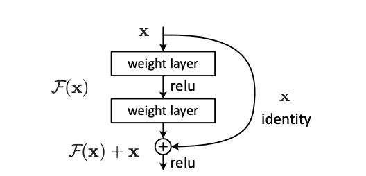

# Visual Encoders From Scratch

### The ResNet architecture

To illustrate our experiments, we will use a ResNet-18 CNN as our visual encoder.

### Quick Recap
The main contribution of ResNet [1] is the use of skip-connections, that aimed to help reduce the issue of degradation of accuracy in deeper networks: 

When the output dimension is the same as the input we can simply add the input to the output:

$$y = F(x, \{W_{i}\}) + x$$

And if the output dimension differ we can perform a linear projection to match the dimensions:

$$y = F(x, \{W_{i}\}) + W_{s}x.$$

[1] [Deep Residual Learning for Image Recognition](https://arxiv.org/abs/1512.03385)